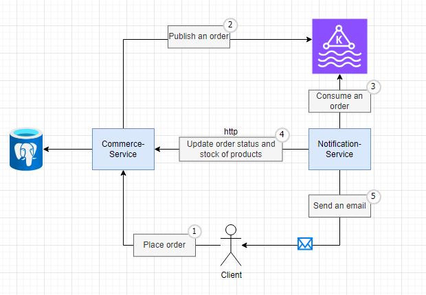

# Commerce Service (commerce-service)

### Service for creating, reading, updating, and deleting products in the catalog, as well as processing orders.

----

### Architecture

-----
## Main features: 

### Product Management:
Add, update, retrieve and remove products from the catalog.

### Category Management:
Activate or deactivate categories and adjust product availability.

### Category Validation:
Products from disabled categories are not displayed, and the category itself is also hidden.

### Order Management:
Create an order, update the order status and quantity of products in stock according to the quantity of products that have been purchased.

-----
### Error Handling
The commerce-service implements error handling to ensure system robustness. Here are the exceptions handled:

| Error Code | Erro Message                  |
|-----------:|-------------------------------|
|       C01	 | Category not found.           | 
|       C02	 | This Category Already Exists. | 
|       P01	 | Product not found.            |
|       P02	 | This Product Already Exists.  |
|      OR01	 | Order not found.              |
|      OR02	 | This Status Order Is Invalid. |
-----
### Settings:
Commerce-service settings are available in the application.properties file.

This includes settings related to Caffeine Cache, Postgres, Kafka and other service-specific options.

-----
### How to Contribute
If you want to contribute to development or fixing issues, feel free to open issues or submit pull requests. Be sure to follow the project's contribution guidelines.

-----
### Technologies Used: 
Framework: Quarkus

Language: Java

Database: PostgreSQL

Cache: Caffeine

Data Stream: Kafka

Migration: Flyway

-----
To access Swagger, run the project and type in the browser: http://localhost:8080/q/swagger-ui

